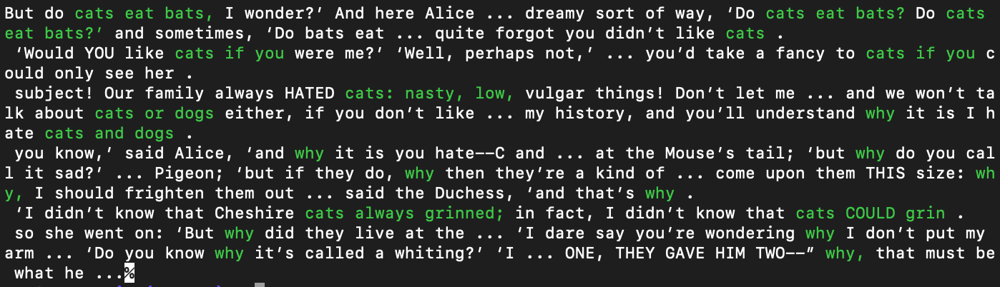

# Contex

This is tool that is used to gain some insight into how words appear in a plain text document. Contex currently works as
follows. 

```
contex -f "corpusdata/frankens.txt" -l "list.txt"
```
where
```
-f specifies the document
-l specifies the list of queries 
```
The list of queries are in the following format
```
string_query1 ,number_of_words_after_query1_to_highlight
string_query2 ,number_of_words_after_query2_to_highlight
...
```
Contex will find all queries even if they are peppered with puncuation. Each query forms a window of five words either
side of the total query and will truncate this window if a full stop is encountered. If there is an overlap in query
windows then these windows are merged into a larger query window. 

we get the following output for the input list
```
cat ,3
why ,1
```




Build:

```
cmake -H. -Bbuild
make -C build

```


